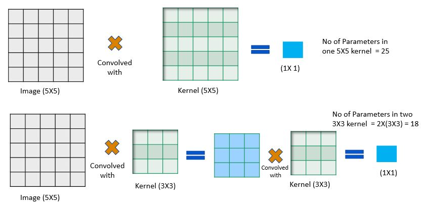
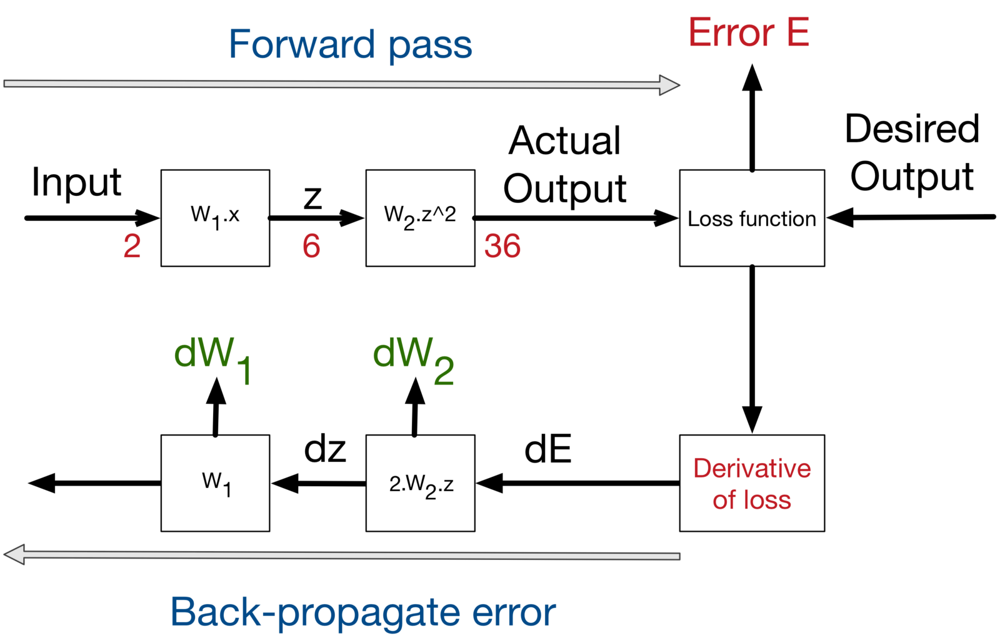

# EVA7 - WEEK 1 Assignment #

### 1. What are Channels and Kernels (according to EVA)? ###
***ANS :***
**Kernel**  are feature extractors. Mathematically a kernel is a matrix of weights( w.r.t EVA its size is 3X3) 
which is convolved with the image/input channels to extract low/high level features.
 The values/weights of the kernel and the symmetry is responsible for extracting a particular type of feature.
For example, the below 3X3 kernel can be used to extract horizontal egges in input image.
|-1|-1 |-1|
|:---:|:---:|:---:|
| 0 |0 |0 |
| 1 | 1 |1 |

***How does the kernel extract features?***
- A kernel slides over the input data, performing an element-wise multiplication with the part of the input it is currently on, 
and then summing up the results into a single output pixel.
- The kernel repeats this process for every location it slides over and extracts the feature as shown below. 

  			  

  Output of the convolution of an image with a kernel is a channel, containing only a specific feature. As it extracts features,
  on that pretext its also called a feature extractor. Feature to be extracted have not to be only vertical or horizontal edges, it can
  be an arch, a blob, a  blank space etc

__**Channels :**__
  Channels are the outcome of images convolved with a definite kernel. each Channel contains only a specific feature i.e. a channel is a 
collection of same/similar features. For example, after convoluting an image with different kernels one at a time we will get as many channels 
and lets say one channel will have all the vertical
edges present in image while other can have all the horizontal edges and similarly one specific feature contained in other channels.
  In a more general context, in the below Image we can see that it is a Image with different Alphabets present in it.

  			  

In the above image we can consider each alphabet as a feature. Each alphabet information can be stored in one channel. Hence this image can be 
represented in 52 channels each representing a feature of small and capital letter in it. So we can think of our image as a set of different channels.

### 2. Why should we (nearly) always use 3x3 kernels? ###
***ANS :***
below are the reasons for mostly using 3X3 kernel
1. Using an odd size kernel makes the kernel symmetric.

2. To get a receptive filed of 5X5, one stage convolution with 5X5 kernel is required.
 Whereas to get the same receptive filed with 3X3 kernel, 2 stage convolution with 3x3 kernel is essential.
  Image(5X5) -> Convolved with 5X5 -> 1X1
  Image(5X5) -->Convolved with 3X3 --> 3X3 ->convolved with 3X3 -> 1X1

  			  

3. Reduced number of operations:
Number of multiplication operations(FLOPs) while convolving using 3X3 kernel is lesser in comparison to bigger kernels to get the same receptive field.
  If image size is 32x32, Continuing on the example shown in point 2
  Number of Multiplication operations while using 5X5 kernel -> 32 * 32 * 25 -> 25600 operations.
  Number of Multiplication operations while using 3X3 kernel -> 32 * 32 * 9 + 32 * 32 * 9 -> 18432 operations.

4. In recent times, the hardwares come accelerated for 3X3 kernel operations.

### 3. How many times to we need to perform 3x3 convolutions operations to reach close to 1x1 from 199x199 (type each layer output like 199x199 > 197x197...) ###
***ANS :***
99 Times
 
 199x199 > 197x197 > 195x195 > 193x193 > 191x191 > 189x189 > 187x187 > 185x185 > 183x183 > 181x181 > 179x179 > 177x177 > 175x175 > 173x173 > 171x171 > 169x169 > 
 167x167 > 165x165 > 163x163 > 161x161 > 159x159 > 157x157 > 155x155 > 153x153 > 151x151 > 149x149 > 147x147 > 145x145 > 143x143 > 141x141 > 139x139 > 137x137 >
 135x135 > 133x133 > 131x131 > 129x129 > 127x127 > 125x125 > 123x123 > 121x121 > 119x119 > 117x117 > 115x115 > 113x113 > 111x111 > 109x109 > 107x107 > 105x105 >
 103x103 > 101x101 > 99x99 > 97x97 > 95x95 > 93x93 > 91x91 > 89x89 > 87x87 > 85x85 > 83x83 > 81x81 > 79x79 > 77x77 > 75x75 > 73x73 > 71x71 > 69x69 > 67x67 > 65x65 > 
 63x63 > 61x61 > 59x59 > 57x57 > 55x55 > 53x53 > 51x51 > 49x49 > 47x47 > 45x45 > 43x43 > 41x41 > 39x39 > 37x37 > 35x35 > 33x33 > 31x31 > 29x29 > 27x27 > 25x25 > 
 23x23 > 21x21 > 19x19 > 17x17 > 15x15 > 13x13 > 11x11 > 9x9 > 7x7 > 5x5 > 3x3 > 1x1
 
 ### 4. How are kernels initialized? ###
***ANS :***
Weights of the kernel can be initialized using random values, though it is better to use more complex methods like Xavier and MSRA initializations whose values may seem random or arbitrary but they help in faster convergence of the network.

So if your model doesn't converge, you might want to look at your initialization strategies.
**Why Initialize Weights**  
The aim of weight initialization is to prevent layer activation outputs from exploding or vanishing during the course of a forward pass through a deep neural network. If either occurs, loss gradients will either be too large or too small to flow backwards beneficially, and the network will take longer to converge if it is even able to do so at all. 

Generally, there are four ways to initialize the weights of the kernels before we start training our neural network.
  1. Zero initialization
  2. Random initialization
  3. Xavier Initialization 
  4. He-et-al initialization 

Additionally, when we are training pre-trained models for additional data, we load the existing weights i.e. we initialise the kernel values with pre-trained model's kernel values, and then further train the model with new data to further optimize 
the model (there by update kernel values) for the newly obtained data.

### 5.What happens during the training of a DNN? ###
***ANS :***
To understand what happens during training a Deep Neural network we should first understand what a deep neural network is made of and how it works. By understanding what happens during the training process of a neural network we are essentially trying to understand how a neural network learns.

  			  

During training, back propagation is used to train the weights, from output towards the input layers. Loss is calculated based on the difference between the correct output and the model's output, and a loss function is used to calculate the loss. The Loss is used to calculate the gradients. And gradients are used to update the weights of the Deep Neural Network.

Weights (in any layer ) are increased or decreased by looking into the gradient of the succeeding layer by the optimizer.

This change is proportional to the learning rate (we set) and also the position of the layer from the output layer (i.e. gradient of the previous layer).

  			  

