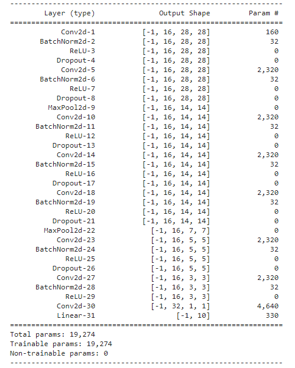
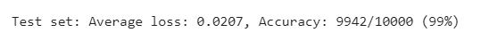

# EVA7 Assignment 4
### Sunil K V

The task was to build a CNN network & train a model that can classify MNIST data with the following constraints:
* 99.4% validation accuracy
* Less than 20k Parameters
* You can use anything from above you want. 
* Less than 20 Epochs
* Have used BN, Dropout, a Fully connected layer, have used GAP. 
 

## Final Model 

## Best Test Accuracy

## Approach
The 20k parameters constraint meant that each Conv2d layer could not use more than 16 kernels.
Therefore the default architecture in the notebook is modified so as to reduce the number of kernels to 16 at each conv2d
operation. 

To enhance our model's classification capacity we add a fully connected layer at the end
 of our final convolution block. We also add:
  1) BatchNorm to normalize our features after each conv2d operation
  2)  Dropout after ReLU to regularize our model. 
  
By making these changes we successfully restrict our model to `19,274` params and attain a maximum Test accuracy of `99.46%`. 
